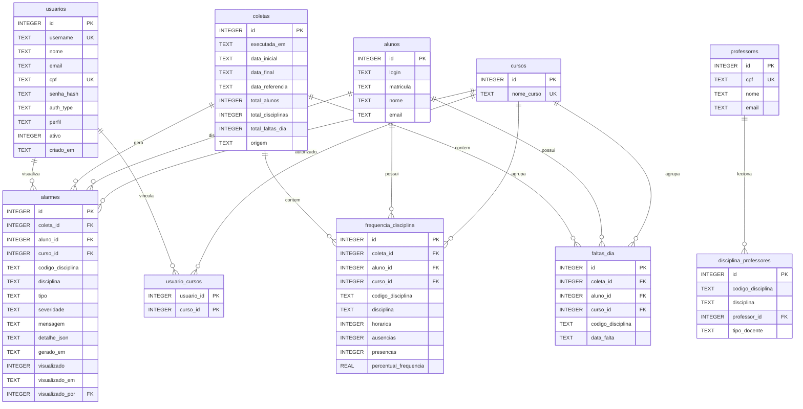

# Banco de dados do MAPA

Documentação do SQLite usado pelo Monitor de Acompanhamento da Permanência Acadêmica.

| Item | Valor |
|------|--------|
| Arquivo | `data/mapa.db` |
| Schema | [`config/schema.sql`](../config/schema.sql) |
| Configuração | `DB_PATH` no `.env` (padrão: `data/mapa.db`) |
| Estrutura do projeto | [`estrutura.md`](estrutura.md) |

## Visão geral

- **SQLite** no desenvolvimento local (sem servidor de banco).
- **Python** grava (importação de frequência e geração de alarmes).
- **PHP** lê (portal, analytics e listagem de alarmes).
- **JSON** em `data/json/` permanece apenas como cache da coleta SIGAA.

```text
SIGAA API → Python (executar_coleta.py) → data/json/ + data/mapa.db
                                              ↓
                                         PHP (portal)
```

Pipeline completo (ordem e arquivos): [`python/README.md`](../python/README.md).

---

## Diagrama entidade-relacionamento



---

## Tabelas

### `usuarios`

Usuários do portal. Cada usuário escolhe autenticação **local** (hash no banco) ou **LDAP** (mesmo fluxo do EduCuidar).

| Coluna | Tipo | Obrigatório | Descrição |
|--------|------|-------------|-----------|
| `id` | INTEGER | sim (PK) | Identificador |
| `username` | TEXT | sim (UNIQUE) | Login do portal |
| `nome` | TEXT | sim | Nome de exibição |
| `email` | TEXT | não | E-mail |
| `cpf` | TEXT | não (UNIQUE) | CPF com 11 dígitos |
| `senha_hash` | TEXT | não | Hash bcrypt/argon (`password_hash`); só para `auth_type=local` |
| `auth_type` | TEXT | sim | `local` ou `ldap` (padrão `local`) |
| `perfil` | TEXT | sim | `administrador`, `coordenador_curso`, `geral` ou `professor` |
| `ativo` | INTEGER | sim | `1` ativo, `0` inativo (padrão `1`) |
| `criado_em` | TEXT | sim | Data/hora de criação (`datetime('now')`) |

Senhas locais **nunca** são gravadas em texto aberto — apenas `senha_hash`. Usuários LDAP não têm senha no MAPA.

**Perfis:**
- `administrador` — tudo, inclusive gestão de usuários e configuração LDAP
- `coordenador_curso` — alarmes apenas dos cursos em `usuario_cursos`
- `geral` — tudo exceto gestão de usuários
- `professor` — alarmes apenas das disciplinas vinculadas ao CPF em `professores` / `disciplina_professores`
---

### `configuracoes`

Chave/valor para parâmetros sensíveis do sistema (não ficam no `.env`).

| Coluna | Tipo | Obrigatório | Descrição |
|--------|------|-------------|-----------|
| `chave` | TEXT | sim (PK) | Identificador (ex.: `ldap_host`) |
| `valor` | TEXT | sim | Valor da configuração |
| `descricao` | TEXT | não | Texto descritivo |
| `atualizado_em` | TEXT | sim | Última alteração |

**Chaves LDAP** (tela `/configuracoes/ldap`, só administrador):

| Chave | Uso |
|-------|-----|
| `ldap_host` | Endereço do servidor (`ldap://…` / `ldaps://…`) |
| `ldap_base_dn` | Base DN da busca |
| `ldap_bind_dn` | DN do bind administrativo (opcional) |
| `ldap_bind_password` | Senha do bind (nunca exibida no formulário) |
| `ldap_user_attribute` | Atributo de login (`sAMAccountName`, `uid`, etc.) |

---

### `usuario_cursos`

Cursos autorizados para um usuário com perfil `coordenador_curso`.

| Coluna | Tipo | Obrigatório | Descrição |
|--------|------|-------------|-----------|
| `usuario_id` | INTEGER | sim (PK, FK) | → `usuarios.id` |
| `curso_id` | INTEGER | sim (PK, FK) | → `cursos.id` |

**ON DELETE CASCADE** nas duas FKs.

---

### `coletas`

Cada execução de importação de frequência (histórico).

| Coluna | Tipo | Obrigatório | Descrição |
|--------|------|-------------|-----------|
| `id` | INTEGER | sim (PK) | Identificador |
| `executada_em` | TEXT | sim | Momento da importação |
| `data_inicial` | TEXT | não | Início do período (ISO `AAAA-MM-DD`) |
| `data_final` | TEXT | não | Fim do período |
| `data_referencia` | TEXT | não | “Hoje” simulado dos critérios |
| `total_alunos` | INTEGER | sim | Contagem na importação |
| `total_disciplinas` | INTEGER | sim | Contagem na importação |
| `total_faltas_dia` | INTEGER | sim | Contagem na importação |
| `origem` | TEXT | não | Ex.: `tabela_frequencia.json` |

Datas de período vêm de `config/consultas.json`.

---

### `alunos`

Dimensão aluno (login + matrícula).

| Coluna | Tipo | Obrigatório | Descrição |
|--------|------|-------------|-----------|
| `id` | INTEGER | sim (PK) | Identificador |
| `login` | TEXT | sim | Login SIGAA |
| `matricula` | TEXT | sim | Matrícula |
| `nome` | TEXT | sim | Nome civil / cadastral |
| `nome_social` | TEXT | não | Nome social (quando houver) |
| `email` | TEXT | não | E-mail (a API pode retornar nulo) |

**Unique:** `(login, matricula)`.

---

### `cursos`

Dimensão curso.

| Coluna | Tipo | Obrigatório | Descrição |
|--------|------|-------------|-----------|
| `id` | INTEGER | sim (PK) | Identificador |
| `nome_curso` | TEXT | sim (UNIQUE) | Nome do curso |

---

### `professores`

Docentes da consulta de matriculados (`resposta_matriculas.json`).

| Coluna | Tipo | Obrigatório | Descrição |
|--------|------|-------------|-----------|
| `id` | INTEGER | sim (PK) | Identificador |
| `cpf` | TEXT | sim (UNIQUE) | CPF com 11 dígitos |
| `nome` | TEXT | sim | Nome do professor |
| `email` | TEXT | não | E-mail (`email_docente` na API de matriculados) |

---

### `disciplina_professores`

Vínculo N:N entre código da disciplina e professor.

| Coluna | Tipo | Obrigatório | Descrição |
|--------|------|-------------|-----------|
| `id` | INTEGER | sim (PK) | Identificador |
| `codigo_disciplina` | TEXT | sim | Código (ex.: `POA-GOP001`) |
| `disciplina` | TEXT | sim | Nome da disciplina |
| `professor_id` | INTEGER | sim (FK) | → `professores.id` |
| `tipo_docente` | TEXT | não | Ex.: `Docente`, `Docente externo` |

**Unique:** `(codigo_disciplina, professor_id)`.  
**Índice:** `idx_disciplina_professores_codigo` em `codigo_disciplina`.  
**ON DELETE CASCADE** na FK para `professores`.

---

### `frequencia_disciplina`

Snapshot de frequência por disciplina em uma coleta.

| Coluna | Tipo | Obrigatório | Descrição |
|--------|------|-------------|-----------|
| `id` | INTEGER | sim (PK) | Identificador |
| `coleta_id` | INTEGER | sim (FK) | → `coletas.id` |
| `aluno_id` | INTEGER | sim (FK) | → `alunos.id` |
| `curso_id` | INTEGER | sim (FK) | → `cursos.id` |
| `codigo_disciplina` | TEXT | sim | Código (ex.: `POA-PAN203`) |
| `disciplina` | TEXT | sim | Nome da disciplina |
| `horarios` | INTEGER | sim | Carga em horários |
| `ausencias` | INTEGER | sim | Ausências |
| `presencas` | INTEGER | sim | Presenças |
| `percentual_frequencia` | REAL | não | Percentual de frequência |

**Unique:** `(coleta_id, aluno_id, curso_id, codigo_disciplina)`.  
**Índice:** `idx_freq_percentual` em `percentual_frequencia`.  
**ON DELETE CASCADE** nas FKs para `coletas`, `alunos` e `cursos`.

---

### `faltas_dia`

Uma linha por data de falta (base de séries temporais e regras de janela).

| Coluna | Tipo | Obrigatório | Descrição |
|--------|------|-------------|-----------|
| `id` | INTEGER | sim (PK) | Identificador |
| `coleta_id` | INTEGER | sim (FK) | → `coletas.id` |
| `aluno_id` | INTEGER | sim (FK) | → `alunos.id` |
| `curso_id` | INTEGER | sim (FK) | → `cursos.id` |
| `codigo_disciplina` | TEXT | sim | Código da disciplina |
| `data_falta` | TEXT | sim | Data ISO `AAAA-MM-DD` |

**Unique:** `(coleta_id, aluno_id, curso_id, codigo_disciplina, data_falta)`.  
**Índice:** `idx_faltas_data` em `data_falta`.  
**ON DELETE CASCADE** nas FKs.

---

### `alarmes`

Sinais de risco de evasão gerados a partir da coleta.

| Coluna | Tipo | Obrigatório | Descrição |
|--------|------|-------------|-----------|
| `id` | INTEGER | sim (PK) | Identificador |
| `coleta_id` | INTEGER | sim (FK) | → `coletas.id` |
| `aluno_id` | INTEGER | sim (FK) | → `alunos.id` |
| `curso_id` | INTEGER | sim (FK) | → `cursos.id` |
| `codigo_disciplina` | TEXT | sim | Código; vazio (`''`) se o alarme for agregado ao curso |
| `disciplina` | TEXT | não | Nome da disciplina |
| `tipo` | TEXT | sim | Ver [tipos de alarme](#tipos-de-alarme) |
| `severidade` | TEXT | sim | `alto` ou `critico` (padrão `alto`) |
| `mensagem` | TEXT | sim | Texto curto para a UI |
| `detalhe_json` | TEXT | não | Payload JSON (percentuais, datas, semanas) |
| `gerado_em` | TEXT | sim | Momento da geração |
| `visualizado` | INTEGER | sim | `0` aberto, `1` com contato registrado (padrão `0`) |
| `visualizado_em` | TEXT | não | Data/hora do contato |
| `visualizado_por` | INTEGER | não (FK) | → `usuarios.id` (quem registrou) |
| `contato_tipo` | TEXT | não | `email`, `whatsapp`, `telefone`, `presencial` ou `assistencia` |

**Unique:** `(coleta_id, aluno_id, curso_id, codigo_disciplina, tipo)`.  
**Índice:** `idx_alarmes_visualizado` em `visualizado`.  
**ON DELETE CASCADE** em coleta/aluno/curso; **ON DELETE SET NULL** em `visualizado_por`.

---

## Relacionamentos

| De | Para | Cardinalidade | Regra |
|----|------|---------------|--------|
| `frequencia_disciplina.coleta_id` | `coletas.id` | N:1 | CASCADE |
| `frequencia_disciplina.aluno_id` | `alunos.id` | N:1 | CASCADE |
| `frequencia_disciplina.curso_id` | `cursos.id` | N:1 | CASCADE |
| `faltas_dia.coleta_id` | `coletas.id` | N:1 | CASCADE |
| `faltas_dia.aluno_id` | `alunos.id` | N:1 | CASCADE |
| `faltas_dia.curso_id` | `cursos.id` | N:1 | CASCADE |
| `alarmes.coleta_id` | `coletas.id` | N:1 | CASCADE |
| `alarmes.aluno_id` | `alunos.id` | N:1 | CASCADE |
| `alarmes.curso_id` | `cursos.id` | N:1 | CASCADE |
| `alarmes.visualizado_por` | `usuarios.id` | N:1 | SET NULL |
| `disciplina_professores.professor_id` | `professores.id` | N:1 | CASCADE |
| `usuario_cursos.usuario_id` | `usuarios.id` | N:1 | CASCADE |
| `usuario_cursos.curso_id` | `cursos.id` | N:1 | CASCADE |

Não há FK direta de `faltas_dia` / `alarmes` para `frequencia_disciplina`: o vínculo com a disciplina é pelo campo `codigo_disciplina` (mais `aluno_id`, `curso_id` e `coleta_id`).

---

## Tipos de alarme

| Tipo | Critério | Escopo típico |
|------|----------|---------------|
| `percentual_baixo` | Frequência &lt; 75% na disciplina | Por disciplina |
| `faltas_4dias` | 3 ou mais dias úteis de falta nos últimos 4 dias úteis | Por aluno/curso (agregado) |
| `faltas_3semanas` | Falta em 3 semanas consecutivas; última falta na janela (referência até 7 dias antes); severidade `critico` | Por disciplina |

Gerados por `python/gerar_alarmes.py` com a `data_referencia` de `config/consultas.json`.

---

## Como popular / regenerar

Use o pipeline completo:

```bash
python3 python/executar_coleta.py
```

Ordem das etapas e o que cada uma lê/gera: [`python/README.md`](../python/README.md).

O schema é aplicado automaticamente na primeira conexão PHP (`Database.php`) ou Python (`db.py`).

---

## Consultas usuais no analytics

- Frequência média por curso → `frequencia_disciplina` + `cursos`
- Faltas por dia da semana → `strftime('%w', data_falta)` em `faltas_dia`
- Evolução mensal de faltas → `strftime('%Y-%m', data_falta)` em `faltas_dia`
- Disciplinas críticas → `AVG(percentual_frequencia)` com filtro &lt; 75%
- Alarmes abertos → `alarmes` onde `visualizado = 0`
